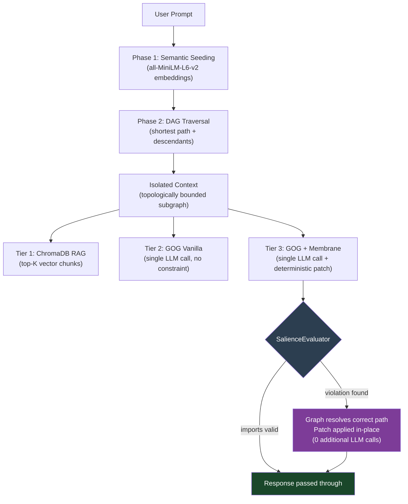

# Graph-Oriented Generation (GOG) — Symbolic Reasoning Model (SRM)

> **Active research prototype.** The architecture is under active development; the benchmarks are reproducible and the results are real. Structural feedback and contributions are welcome via issues or pull requests.

This repository implements and benchmarks **Graph-Oriented Generation (GOG)**, a context-isolation strategy for LLM-assisted code tasks that replaces probabilistic vector retrieval with deterministic graph traversal over a project's actual dependency structure.

The accompanying white paper is available in [`Graph_Oriented_Generation__GOG_.pdf`](./Graph_Oriented_Generation__GOG_.pdf).

---

## Motivation

Standard Retrieval-Augmented Generation (RAG) retrieves context by computing cosine similarity between a prompt embedding and a vector index of document chunks. For open-domain question answering over unstructured text, this is a reasonable approach. For software codebases, it introduces a structural mismatch:

> A software repository is not a collection of semantically similar documents — it is a directed graph of hard import dependencies. Two files can be semantically distant in embedding space yet be the only files that directly depend on each other. A vector search has no way to represent this relationship.

GOG addresses this by building a `networkx` directed acyclic graph (DAG) from the actual `import` statements in a codebase, parsed by a `tree-sitter` AST. Context isolation becomes a graph traversal problem rather than a similarity search problem. This produces a smaller, structurally correct context payload — with measurable token reduction and no false positives introduced by semantic noise.

### Relation to Prior Work

Microsoft's [GraphRAG](https://arxiv.org/abs/2404.16130) (Edge et al., 2024) applies graph structures to knowledge graphs built over document corpora for summarisation tasks. GOG operates on a different graph type — the structural import DAG of a software project — and targets a different task: precise dependency isolation for code generation rather than community-aware document retrieval. The two approaches are complementary rather than competing.

---

## Architecture

### Phase 1 — Semantic Seeding

The prompt is embedded using `all-MiniLM-L6-v2` (sentence-transformers). Each node's filename is converted to a readable label (e.g. `authStore.ts` → `"auth Store"`) and similarly embedded. Nodes whose cosine similarity to the prompt exceeds a configurable threshold (`SEED_SIMILARITY_THRESHOLD = 0.25`) are selected as entry points. This replaces the brittle keyword-matching approach described in the original paper (§4.5) and allows prompts that lack explicit architectural vocabulary to correctly identify seed nodes.

### Phase 2 — Deterministic Traversal

Once seed nodes are established, all context isolation is performed via standard graph operations: shortest-path between seed pairs and transitive descendant expansion. No probabilistic inference occurs after the seeding step. The resulting subgraph contains only files that are reachable from the seeds via real import edges.

### Phase 3 — Neuro-Symbolic Membrane (Tier 3 only)

The `SalienceEvaluator` acts as a post-generation constraint layer. After the LLM generates a response, the Membrane:

1. Extracts all `import` statements from the generated code via `tree-sitter` AST (with regex fallback for edge cases).
2. Checks each local import against the set of files the DAG isolated (`allowed_nodes`).
3. If all imports are valid: passes the response through unchanged.
4. If violations are found: **deterministically patches** each illegal import by resolving the correct path from `allowed_nodes` using basename matching — no second LLM call, no extra tokens.

If a hallucinated file has no match anywhere in the allowed set (i.e., the file genuinely does not exist in the graph), the import is commented out with a `// [SRM PATCH: hallucinated import removed]` annotation, keeping the output syntactically valid.



---

## Benchmark Design

Both benchmark scripts run three pipelines on identical code-generation tasks against a procedurally generated 100+ file Vue/TypeScript repository containing deliberate red-herring components (files that share keyword overlap with target prompts but have no structural connection to the execution path).

| Tier | Pipeline | Context Source | Post-generation Constraint |
|------|----------|---------------|---------------------------|
| **1** | RAG Control | ChromaDB top-5 vector chunks | None |
| **2** | GOG Vanilla | DAG-isolated subgraph | None |
| **3** | GOG + Membrane | DAG-isolated subgraph | Deterministic import patching |

### Task Prompts

| Level | Task | Structural Complexity |
|-------|------|-----------------------|
| Easy | Add `lastLogin` timestamp to `authStore.ts` | Single-file mutation |
| Medium | Wire a Logout button in `HeaderWidget.vue` to `useAuthStore` | Two-file dependency bridge |
| Hard | Implement Delete Account across `api_client.ts`, `authStore.ts`, `UserSettings.vue` — without importing `api_client.ts` directly into the Vue component | Three-file topological constraint |

### Representative Results

Results from a single run (cloud CLI, opencode). Token counts use `tiktoken` `cl100k_base` encoding.

Results are reported for two configurations: cloud CLI (opencode, frontier model) and local GPU (llama3:8b, Ollama, NVIDIA GPU with 6 GB VRAM). Token counts use `tiktoken` `cl100k_base` encoding.

**Cloud CLI (opencode)**

| Metric | Tier 1 · RAG | Tier 2 · GOG | Tier 3 · GOG + Membrane |
|--------|-------------|-------------|------------------------|
| Easy — Tokens In | 53,137 | 6,323 | 6,323 |
| Easy — Token Reduction | baseline | **88.1% ↓** | **88.1% ↓** |
| Easy — Topological Patches | — | — | 1 |
| Hard — Tokens In | 61,744 | 6,249 | 6,249 |
| Hard — Token Reduction | baseline | **89.9% ↓** | **89.9% ↓** |
| Hard — Total Execution Time | 64.8s | 65.5s | **45.7s** |

**Local GPU (llama3:8b, GPU-accelerated)**

| Metric | Tier 1 · RAG | Tier 2 · GOG | Tier 3 · GOG + Membrane |
|--------|-------------|-------------|------------------------|
| Easy — Tokens In | 53,137 | 6,323 | 6,323 |
| Easy — Token Reduction | baseline | **88.1% ↓** | **88.1% ↓** |
| Easy — LLM Generation Time | 39.1s | 41.5s | **38.3s** |
| Medium — Tokens In | 53,136 | 40,566 | 40,566 |
| Medium — Token Reduction | baseline | **23.7% ↓** | **23.7% ↓** |
| Medium — Correctness | PASS 5/5 | PASS 5/5 | PASS 5/5 |
| Hard — Tokens In | 74,130 | 6,249 | 6,249 |
| Hard — Token Reduction | baseline | **91.6% ↓** | **91.6% ↓** |
| Hard — Total Execution Time | 45.8s | 48.9s | **39.4s** |
| Hard — Topological Patches | — | — | 0 |

On the Hard task (GPU run), GOG isolated a single file (`api_client.ts`) from a 100+ file repository. Tier 3 produced a clean, correct Vue component with zero hallucinated imports and no Membrane patches needed — the graph constraint prevented the import violation before generation. LLM generation time dropped ~14% vs RAG despite the model receiving the same prompt length. The primary savings are in token delivery cost and context precision, not raw decode speed (see Known Limitations for the CPU vs GPU timing discussion).

### Correctness Scoring

The benchmark includes a deterministic correctness rubric applied to each response after generation — no second LLM call. Each task has a set of structural criteria (required keywords, patterns, forbidden imports) evaluated by string matching against the known-correct answer structure. Results are reported as PASS / PARTIAL / FAIL alongside token metrics.

This is not a semantic judge and does not evaluate code quality. It is a structural signal: does the response contain the architectural elements the task requires? A PASS means the response is structurally plausible. A FAIL means a required element is missing or a constraint is violated. The rubric intentionally errs toward leniency — the goal is to surface clear failures, not to penalise stylistic variation.

---

## Research Roadmap

GOG is one component of a larger theoretical framework called the **Symbolic Reasoning Model (SRM)**. Understanding the distinction between these two layers is important for interpreting current results and the direction of future work.

### Track 1 — GOG: Deterministic Context Isolation *(this paper)*

GOG answers one question: *does deterministic graph traversal deliver more precise context than vector similarity for structured codebases?* The benchmark here tests that claim directly. Results are reproducible.

It is important to note what this track does **not** test. The LLMs used in this benchmark are still performing architectural reasoning themselves — they receive a smaller, cleaner input, but they are still deciding what code to write. GOG improves the retrieval layer. It does not yet offload the reasoning layer.

### Track 2 — Neuro-Symbolic Membrane: Post-generation Constraint *(in progress)*

The `SalienceEvaluator.patch()` method is the first implemented SRM primitive. The symbolic layer (the graph) corrects the neural layer (the LLM) deterministically after generation — zero retries, zero extra tokens. The current implementation handles import path correction. The next iteration will move this upstream: the symbolic layer pre-computes a structured mutation spec *before* the LLM call, rather than correcting errors after it.

### Track 3 — SRM: Full Symbolic Reasoning Offload *(future work)*

The long-term thesis is that LLMs are being misused when asked to perform architectural reasoning. The 0.5B local model results in this benchmark illustrate this directly — the model fails not because it lacks language ability, but because planning a multi-file architectural change is not a language task.

The SRM framework proposes a strict separation of concerns:

| Layer | Responsibility | Implementation |
|-------|---------------|----------------|
| **Symbolic** | All reasoning — dependency resolution, mutation planning, constraint checking | Deterministic graph operations |
| **Neural** | All language — translating a symbolic specification into valid syntax | LLM (any size) |

When this separation is enforced, a small model receives not a natural language task but a precise symbolic specification: *"add field X to state object in node Y, update action Z to assign value W."* The model is translating, not reasoning. Small models are fully capable of translation.

This hypothesis is what the current benchmark is **not yet testing**. Validating it requires a mutation planner — a symbolic system that converts natural language intent into a structured graph diff before any LLM is invoked. That is the subject of the next paper.

---

## Phase 2 Results: SRM Validation (Pilot)

**Status:** Track 3 hypothesis is confirmed on the Easy task (ADD_FIELD + MUTATE_ACTION). Single run, procedurally generated repository, deterministic rubric evaluation.

### Experimental Setup

| Component | Configuration |
|-----------|---|
| Model | qwen2.5:0.5b (500M parameters) |
| Task | Easy: Add `lastLogin` field to `authStore.ts`, set to '2026-03-08' in `login` action |
| Evaluation | Deterministic string-matching rubric (required keywords, forbidden patterns) |

### Results: 0.5B Model Across Three Conditions

| Tier | Context Source | Input | Reasoning Mode | Correctness | Execution Time |
|------|---|---|---|---|---|
| **Tier 1** | RAG + natural language prompt | 53,137 tokens | LLM reasons from raw prompt | **FAIL 2/5** | 5.71s |
| **Tier 2** | GOG + natural language prompt | 6,323 tokens | LLM reasons from isolated context | **PARTIAL 4/5** | 11.63s |
| **Tier 3** | GOG + symbolic specification | 6,323 tokens | LLM renders from symbolic spec | **PASS 5/5** | 0.94s |

### Output Comparison (Same 0.5B Model, Same Task)

**Tier 1 Output (FAIL 2/5):**
```typescript
// Redux patterns — never produced Pinia defineStore
// Model defaulted to training distribution over given context
import { Store } from 'redux';
const authStore = (state = DUMMY_ASSETS, action) => {
  // ... Redux reducer logic
}
```

**Tier 2 Output (PARTIAL 4/5):**
```typescript
// Understood task partially, cannot produce defineStore syntax
// Reasoning burden too high for model scale
const lastLoginTimestamp = '2026-03-08T10:00:00Z';
updateDefaultState({ ...DUMMY_ASSETS, asset: lastLoginTimestamp });
```

**Tier 3 Output (PASS 5/5):**
```typescript
// Correct Pinia syntax, correct mutations, correct imports
// Model received: symbolic spec + clean code, no reasoning required
export const useAuthStore = defineStore('auth', {
  state: () => ({
    user: { id: 1, role: 'admin' },
    token: 'jwt_xyz',
    lastLogin: ''  // ✓ field added
  }),
  actions: {
    async login(u: string, p: string) {
      await api.login(u, p);
      this.lastLogin = '2026-03-08';  // ✓ value set correctly
    },
    // ... other actions unchanged
  }
});
```

### Interpretation

The 0.5B model's failures on Tiers 1 and 2 were **not language capability failures** — Tier 3 output proves the model can write `defineStore` syntax perfectly. The failures were **reasoning failures**.

When asked to infer *what* to write from natural language, the model failed (Tiers 1 and 2). When told *exactly what* to write via deterministic symbolic specification, it succeeded completely (Tier 3).

This empirically demonstrates the SRM thesis: **LLMs are language renderers, not reasoning engines.** When the reasoning burden is removed and placed in a deterministic symbolic planner, a 500M parameter model produces correct structured code that required 8B+ parameters (or failed entirely) under the raw-prompt regime.

### Additional Metrics

- **Token input:** 6,323 (vs RAG: 53,137) — 88.1% reduction via GOG semantic seeding
- **Execution time:** 0.94s (vs Tier 1: 5.71s) — 83.6% reduction
- **Output tokens:** Minimal. Constrained symbolic spec produces focused generation (no exploration, no explanation).

### Caveats (Documented for Scientific Rigor)

1. **Single task, procedurally generated repository.** This is a proof-of-concept on a controlled benchmark, not a demonstration of generalization across real-world codebases.

2. **Symbolic spec hand-crafted for this task structure.** The symbolic specification was manually designed for ADD_FIELD and MUTATE_ACTION operations. The planner is not learned; it uses hand-written regex patterns and rule-based logic.

3. **Correctness rubric is structural, not semantic.** String-matching for required keywords and forbidden patterns is a signal of structural plausibility, not code quality or runtime correctness. A PASS means the response contains the right elements; it does not mean the code is correct.

4. **Mutations are localized.** The Easy task is a single-file, single-action mutation — a very narrow task. Generalization to more complex refactoring patterns is unknown.

5. **No comparison across model scales under SRM.** This is an ablation study on the effect of removing reasoning burden from a single 0.5B model. It does not compare 0.5B (SRM) vs 7B (raw prompt) or other scale-invariant configurations.

### Significance for the SRM Framework

This result is the centerpiece of SRM's falsifiability. The hypothesis is: *removing reasoning from the LLM and placing it in a deterministic symbolic layer allows smaller models to generate correct code.*

This pilot confirms that mechanism on a single task. It is **not** a proof of generalization; it is a proof that the mechanism works in principle. To validate SRM as a general architectural paradigm would require:
- Evaluation on multiple tasks (Medium, Hard, and additional task types)
- Testing on real-world repositories, not procedurally generated ones
- Comparison across model scales under SRM (0.5B, 1B, 3B, 7B)
- Learned or data-driven planner components, not hand-written patterns

---

## Known Limitations

**Semantic seeder false positives.** The Medium task isolated `mockLogoutHandler.ts` alongside the two genuinely relevant files, reducing token savings from ~88% to ~23.7%. This occurred because `mockLogoutHandler` shares the `logout` keyword with the prompt. Semantic similarity over filenames cannot distinguish between a structurally relevant file and a semantically similar but architecturally disconnected one. A reachability-weighted scoring pass between seed candidates is the planned mitigation.

**Lexical seeding degrades on indirect prompts.** Prompts that use natural language without architectural vocabulary (e.g. "clicks logout from the settings view" rather than "UserSettings logout action") may fail to seed the graph at all, causing a fallback to full-graph context (equivalent to a RAG full-context dump). This is surfaced explicitly in the code rather than silently degraded.

**Benchmark is self-contained.** The target repository is procedurally generated, which allows controlled evaluation of red-herring resistance but limits external validity. Evaluation against real-world repositories is planned for a follow-up.

**Token counts are estimates.** `tiktoken` `cl100k_base` is used as a cross-model proxy. Actual token consumption will vary by model and tokenizer.

---

## Getting Started

### Requirements

```bash
pip install -r requirements.txt
```

Key dependencies: `networkx`, `tree-sitter`, `tree-sitter-typescript`, `chromadb`, `sentence-transformers`, `tiktoken`, `rich`.

> **NumPy compatibility note:** `sentence-transformers` currently requires `numpy<2`. If your environment has NumPy 2.x installed, create a virtual environment first:
> ```bash
> python3 -m venv .venv && source .venv/bin/activate
> pip install "numpy<2" && pip install -r requirements.txt
> ```

### Cloud CLI benchmark (recommended for output quality)

```bash
npm install -g opencode          # install opencode CLI
python3 generate_dummy_repo.py   # generate the 100+ file target repository
python3 seed_RAG_and_GOG.py      # build ChromaDB index + serialize GOG graph
python3 benchmark_cloud_cli.py   # run the 3-tier gauntlet
```

### Local SLM benchmark (fully offline, no API costs)

```bash
curl -fsSL https://ollama.com/install.sh | sh
ollama pull qwen2.5:7b        # recommended minimum for meaningful output quality
python3 generate_dummy_repo.py
python3 seed_RAG_and_GOG.py
python3 benchmark_local_llm.py
```

Both scripts present an interactive difficulty selector (`Easy / Medium / Hard / All`).

> **Model size note:** `qwen2.5:0.5b` is included as a baseline and will run correctly, but at 500M parameters it reaches capability limits on the Medium and Hard tasks — producing syntactically plausible but architecturally incorrect output. This is not a GOG failure; it reflects the model conflating Vue with React and hallucinating file structure it was never given. `qwen2.5:7b` (~4.7 GB) is the recommended minimum for results that meaningfully test GOG's context isolation advantage. `qwen2.5:14b` will produce stronger output if your hardware supports it.
>
> The benchmark sends a brief warmup inference before the gauntlet begins to ensure model weights are loaded into memory and Tier 1 local compute time is not artificially inflated by Ollama's first-load latency.

> **GPU note:** The local benchmark uses Ollama's automatic GPU detection by default — if a CUDA-capable GPU is available, it will be used. To force CPU-only inference (e.g. if you have less than ~5 GB VRAM for a 7b model), set the environment variable before running: `NUM_GPU=0 python3 benchmark_local_llm.py`.
>
> **On CPU vs GPU timing:** Token reduction savings manifest differently by hardware. On CPU-only inference, the bottleneck is autoregressive decode (output tokens generated sequentially) rather than prefill (reading input tokens). Shrinking context from 60K → 6K tokens saves prefill time, which is fast relative to decode on CPU — so wall-clock generation time changes little locally. On GPU, both prefill and decode are faster, and the token reduction advantage appears more clearly in end-to-end timing. The primary measurable benefit of GOG on CPU hardware is context precision and API cost reduction, not local wall-clock speed.

---

## Contributing

The `TypeScriptParser` interface (`extract_imports(file_path) -> List[str]`) is designed to be extended. Parsers for Python, Go, Rust, or other languages with resolvable import graphs would meaningfully expand the benchmark's applicability.

Other areas where contributions are welcome:

- Additional benchmark prompts, particularly those that stress-test the seeder with indirect natural language
- Alternative seeding strategies (e.g. hybrid lexical + semantic, or structure-aware reachability scoring)
- Evaluation against real-world open-source repositories

Please open an issue before submitting a large pull request so we can align on approach first.

---

## Citation

If you use this work, please cite the accompanying paper:

```
Chisholm, D. R. (2026). Graph-Oriented Generation (GOG): Offloading AI Reasoning
to Deterministic Symbolic Graphs. https://github.com/dchisholm125/graph-oriented-generation
```