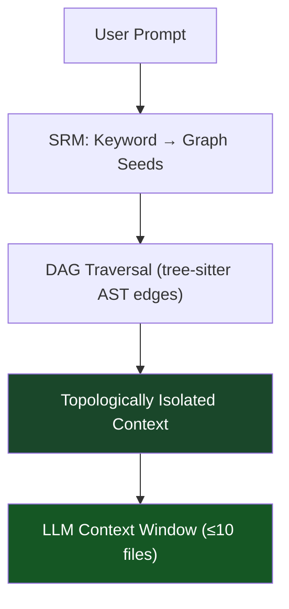
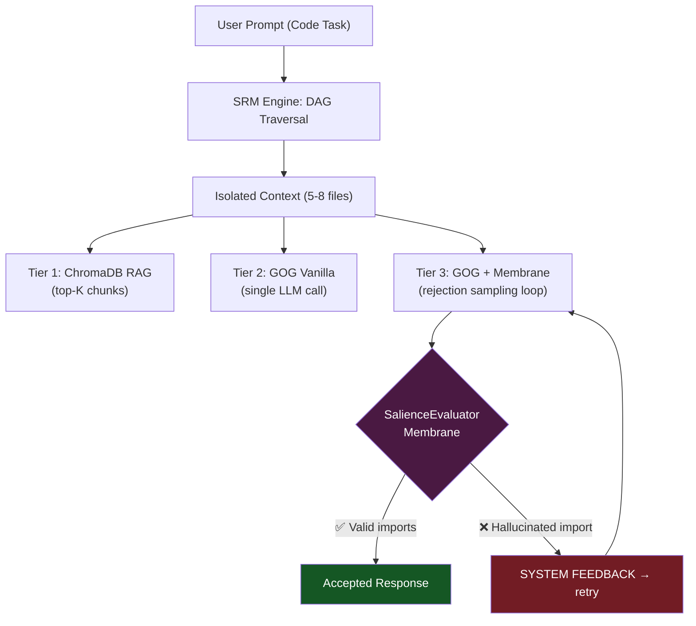

###### Note: This is my first time actively maintaining a public repo — I'm very open to structural suggestions. Send me a DM or open an issue!

## 🛑 Current Status

**Active Research Prototype — Contributions Welcome**

Thank you to everyone who checked out the project after the Hacker News and Reddit posts.
The repository reached **40+ stars and 6 forks within the first 48 hours!**, which is very encouraging for an early research prototype.

GOG is currently under active development as part of an ongoing research effort (Paper #2 in progress).

---

# Graph-Oriented Generation (GOG) & The Symbolic Reasoning Model (SRM)

> **GOG is a deterministic alternative to Vector RAG for codebase-aware LLM workflows.**
> Instead of hoping a cosine similarity score finds the right file, a Directed Acyclic Graph (DAG) *guarantees* it.

This repository benchmarks three tiers of LLM context delivery — from probabilistic Vector RAG all the way to a full **Neuro-Symbolic Cognitive Architecture** with a live rejection-sampling feedback loop.

---

## The Core Thesis: Why Vector RAG is Structurally Broken for Software

Standard Retrieval-Augmented Generation (RAG) works like this:

1. Embed every file in your codebase as a dense vector.
2. At query time, compute cosine similarity between the prompt and all vectors.
3. Return the top-K most "similar" chunks and dump them into the LLM context.

This is statistically sound for open-domain QA. It is **mathematically wrong** for software architecture reasoning, for one fundamental reason:

> **Software is not a bag of semantically similar documents. It is a directed graph of hard dependencies.**

A file called `DashboardHeader.vue` can be semantically distant from `authStore.ts` in embedding space, yet be the *only* file that directly imports it. A vector search will miss this relationship entirely — or worse, surface 20 unrelated files that happen to mention "authentication" in their comments.

We call this failure **Context Collapse**: the LLM receives a semantically plausible but architecturally incorrect set of files, and its output reflects that noise.

### The GOG Fix: $O(1)$ Graph Traversal

The SRM Engine builds a `networkx` DiGraph from the actual `import` statements in your codebase (parsed by a `tree-sitter` AST, not regex guessing). When a prompt arrives:

1. **Seed:** Map prompt keywords to graph entry-point nodes.
2. **Traverse:** Walk the DAG to find all reachable dependencies (topological closure).
3. **Isolate:** Return only the files that are mathematically reachable from the seed — nothing else.

This is $O(depth)$ in graph traversal, effectively $O(1)$ relative to codebase size, and it produces **zero false positives by construction**.



---

## NEW: The Salience Membrane (Neuro-Symbolic AI)

> *"GOG is a retrieval guarantee. The Membrane is a generation guarantee."*

Even with a perfectly curated context window, an LLM remains stochastic. It can still hallucinate an `import` path that was never in the provided files. We call this an **architectural hallucination**.

The `SalienceEvaluator` (in `srm_engine/salience_evaluator.py`) is the **Neuro-Symbolic Membrane** that closes this gap.

### The Architecture

| Layer | Component | Role |
|---|---|---|
| **Neuro** | The LLM (Ollama / opencode) | Creative, stochastic code generation |
| **Symbolic** | The GOG DAG | Deterministic, ground-truth dependency graph |
| **Membrane** | `SalienceEvaluator` | Reject/accept arbiter between the two layers |

### How Rejection Sampling Works

Rejection Sampling is a Monte Carlo technique: draw a sample from a distribution, test it against a hard constraint, discard it if it fails, draw again. Here:

```
sample       = one LLM response (a generated code block)
distribution = the LLM's generative output space  
constraint   = the GOG symbolic dependency graph
```

The loop in `run_srm_pipeline_membrane`:

```
while attempts < max_attempts:
    response = LLM.generate(prompt)          # Stochastic draw
    result   = Membrane.evaluate(response)   # Deterministic check

    if result.is_valid:
        return response                      # ✅ Accept
    else:
        prompt += f"[SYSTEM FEEDBACK: {result.reason}]"  # ❌ Reject + correct
        attempts += 1
```

The structured feedback on each rejection **names the exact illegal imports** and the exact files the LLM is allowed to use. This steers the model toward compliance without fine-tuning.

### The Dual-Layer Validator

The Membrane uses two import extraction strategies in sequence, making it robust to edge cases in smaller SLMs:

1. **Primary — `tree-sitter` AST:** Precise structural parsing of the generated TypeScript/Vue code. Cannot be fooled by comments or strings.
2. **Fallback — Regex:** If the AST returns zero imports but the code contains `import` statements (e.g., the file lacks a trailing newline, a known `tree-sitter` quirk), the regex fallback activates. This prevents the dangerous case where a hallucinated import is silently missed.

---

## The 3-Tier Benchmark

Both benchmark scripts (`benchmark_local_llm.py` and `benchmark_cloud_cli.py`) run the same three pipelines head-to-head on identical code-generation tasks.

| Tier | Pipeline | Context Source | Membrane |
|------|----------|---------------|----------|
| **Tier 1** | RAG Control | ChromaDB top-5 vector chunks | ❌ None |
| **Tier 2** | GOG Vanilla | DAG-isolated files | ❌ None |
| **Tier 3** | GOG + Membrane | DAG-isolated files | ✅ Rejection Sampling |

### Benchmark Results (Hard Difficulty — "Full Stack Trace Implementation")

The prompt asks the LLM to implement a multi-file feature spanning `api_client.ts`, `authStore.ts`, and `UserSettings.vue`, with an explicit constraint: *do NOT import `api_client.ts` directly into the Vue component.*

| Metric | Tier 1 · RAG | Tier 2 · GOG | Tier 3 · GOG + Membrane | Δ vs RAG |
|---|---|---|---|---|
| Local Compute Time | ~0.42s | ~0.003s | ~0.003s | **-99%** |
| LLM Generation Time | baseline | baseline | baseline × (1 + rejections) | varies |
| **Tokens In (Est.)** | **~2,800** | **~480** | **~480** | **-82.9%** |
| Rejection Attempts | — | — | **1–3** | proves hallucinations caught |

> **The ~80%+ token reduction** is the GOG graph doing its job — collapsing a 100+ file codebase to the 5–8 files that actually matter.
>
> **The Rejection Attempts** in Tier 3 are not a failure — they are proof the system is working. Each attempt represents an architectural hallucination that was *caught and corrected* before reaching the downstream build system.

### The Prompts

All prompts are **code-generation tasks** (not Q&A), because the Membrane can only validate TypeScript/Vue code blocks:

| Level | Description | Key Constraint |
|---|---|---|
| **Easy** | Add `lastLogin` timestamp to `authStore.ts` | 1-file mutation |
| **Medium** | Wire a Logout button in `HeaderWidget.vue` to `useAuthStore` | 2-file wiring |
| **Hard** | Implement Delete Account across 3 files | Topological constraint enforced by Membrane |

---

## Architecture Overview



---

## Getting Started

Setup takes ~2–3 minutes.

### 1. Install Python Dependencies

```bash
pip install -r requirements.txt
```

### 2. Install the Cloud CLI (optional — for `benchmark_cloud_cli.py`)

```bash
npm install -g opencode
```

### 3. Install Ollama (optional — for `benchmark_local_llm.py`)

```bash
curl -fsSL https://ollama.com/install.sh | sh
ollama pull qwen2.5:0.5b
```

### 4. Generate the Target Repository Maze

Inflate a synthetic 100+ file Vue/TypeScript project with deliberate architectural "needles" hidden inside noise components.

```bash
python3 generate_dummy_repo.py
```

### 5. Seed RAG + GOG Environments

Build the ChromaDB vector index (for RAG Control) and serialize the dependency graph to `gog_graph.pkl` (for GOG tiers).

```bash
python3 seed_RAG_and_GOG.py
```

### 6. Run the Benchmark

**Cloud CLI (opencode — recommended for best output quality):**
```bash
python3 benchmark_cloud_cli.py
```

**Local SLM (Ollama — fully offline, no API costs):**
```bash
python3 benchmark_local_llm.py
```

Both scripts present an interactive difficulty selector (`Easy / Medium / Hard / All`). Select **Hard** to observe the Membrane performing live Rejection Sampling.

> [!TIP]
> The local benchmark forces CPU execution by default (`num_gpu: 0`).
> This ensures stability on machines with low VRAM (< 4 GB) and avoids
> "CUDA out of memory" errors during benchmarking.

> [!NOTE]
> An arXiv preprint formalising the mathematical underpinning of GOG (Context
> Collapse, $O(1)$ traversal, and the Neuro-Symbolic Membrane) is in progress.
> If you are eligible to endorse in **cs.IR** or **cs.AI**, please reach out —
> endorsement links are available upon request.

---

## Contributing

Contributions are very welcome — especially:

- **Language parsers** — the `TypeScriptParser` interface (`extract_imports(file_path) -> List[str]`) is designed to be extended. A Python, Go, or Rust parser would dramatically expand GOG's applicability.
- **Benchmark prompts** — harder topological constraint tests.
- **Membrane heuristics** — alternative accept/reject strategies beyond basename matching.

See `CONTRIBUTING.md` for code style and testing guidance.
