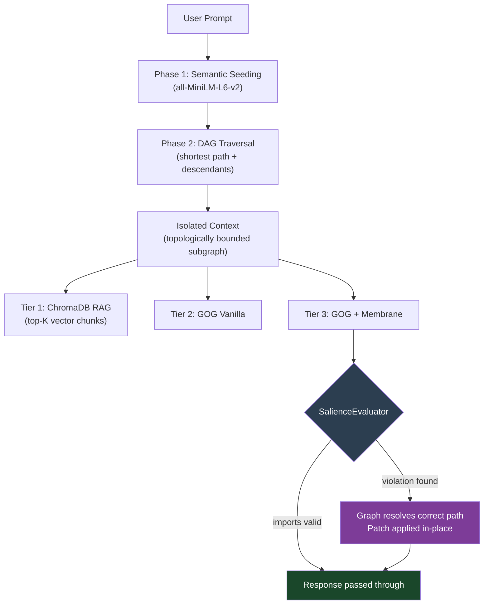

# Graph-Oriented Generation (GOG) — Symbolic Reasoning Model (SRM)

> **Active research prototype.** Benchmarks are reproducible and results are real. Structural feedback and contributions welcome via issues or pull requests.

This repository implements and benchmarks **Graph-Oriented Generation (GOG)**, a context-isolation strategy for LLM-assisted code tasks that replaces probabilistic vector retrieval with deterministic graph traversal over a project's actual import dependency structure.

The accompanying white paper: [`Graph_Oriented_Generation__GOG_.pdf`](./Graph_Oriented_Generation__GOG_.pdf)

---

## The Problem

Standard RAG retrieves context by cosine similarity between a prompt embedding and a vector index. For open-domain question answering, this is reasonable. For software codebases, it introduces a structural mismatch:

> A software repository is not a collection of semantically similar documents — it is a directed graph of hard import dependencies. Two files can be semantically distant in embedding space yet be the only files that directly depend on each other.

GOG addresses this by building a `networkx` DAG from actual `import` statements parsed by `tree-sitter`. Context isolation becomes a graph traversal problem, not a similarity search. The result is a smaller, structurally correct context payload with measurable token reduction and no false positives from semantic noise.

**Relation to prior work:** Microsoft's [GraphRAG](https://arxiv.org/abs/2404.16130) (Edge et al., 2024) applies graph structures to knowledge graphs over document corpora for summarisation. GOG operates on a different graph type — the structural import DAG of a software project — targeting dependency isolation for code generation rather than community-aware document retrieval. The approaches are complementary.

---

## Architecture

**Phase 1 — Semantic Seeding.** The prompt is embedded with `all-MiniLM-L6-v2`. Nodes whose filename embeddings exceed a similarity threshold (`SEED_SIMILARITY_THRESHOLD = 0.25`) are selected as graph entry points.

**Phase 2 — Deterministic Traversal.** Shortest-path between seed pairs and transitive descendant expansion. No probabilistic inference after the seeding step. Only files reachable via real import edges are included.

**Phase 3 — Neuro-Symbolic Membrane (Tier 3).** After generation, the `SalienceEvaluator` extracts all `import` statements from the LLM's output via AST and checks each against the isolated subgraph. Illegal imports are patched in-place by resolving the correct path from the graph — zero retries, zero extra tokens.



---

## Benchmark Design

Three pipelines run against a procedurally generated 100+ file Vue/TypeScript repository containing deliberate red-herring components — files that share keyword overlap with target prompts but have no structural connection to the execution path.

| Tier | Pipeline | Context Source | Post-generation Constraint |
|------|----------|---------------|---------------------------|
| 1 | RAG Control | ChromaDB top-5 vector chunks | None |
| 2 | GOG Vanilla | DAG-isolated subgraph | None |
| 3 | GOG + Membrane | DAG-isolated subgraph | Deterministic import patching |

**Tasks:**

| Level | Task | Complexity |
|-------|------|------------|
| Easy | Add `lastLogin` timestamp to `authStore.ts` | Single-file mutation |
| Medium | Wire Logout button in `HeaderWidget.vue` to `useAuthStore` | Two-file dependency bridge |
| Hard | Implement Delete Account across three files without importing `api_client.ts` into the Vue component | Three-file topological constraint |

### Representative Results

**Cloud CLI (opencode, frontier model)**

| Metric | Tier 1 · RAG | Tier 2 · GOG | Tier 3 · GOG + Membrane |
|--------|-------------|-------------|------------------------|
| Easy — Token Reduction | baseline | **88.1% ↓** | **88.1% ↓** |
| Easy — Patches Applied | — | — | 1 |
| Hard — Token Reduction | baseline | **89.9% ↓** | **89.9% ↓** |
| Hard — Total Execution Time | 64.8s | 65.5s | **45.7s** |

**Local GPU (llama3:8b, Ollama)**

| Metric | Tier 1 · RAG | Tier 2 · GOG | Tier 3 · GOG + Membrane |
|--------|-------------|-------------|------------------------|
| Easy — Token Reduction | baseline | **88.1% ↓** | **88.1% ↓** |
| Medium — Token Reduction | baseline | **23.7% ↓** | **23.7% ↓** |
| Medium — Correctness | PASS 5/5 | PASS 5/5 | PASS 5/5 |
| Hard — Token Reduction | baseline | **91.6% ↓** | **91.6% ↓** |
| Hard — Total Execution Time | 45.8s | 48.9s | **39.4s** |

On the Hard task, GOG isolated a single file from a 100+ file repository. Tier 3 produced a correct Vue component with zero hallucinated imports and no Membrane patches needed — the graph constraint prevented the import violation before generation.

**Correctness rubric:** Deterministic string-matching against known-correct structural criteria (required keywords, forbidden imports). No second LLM call. Reports PASS / PARTIAL / FAIL alongside token metrics. Structural completeness (valid `defineStore` shape for Pinia stores, `<script>` + `<template>` blocks for Vue components) is verified before semantic string matching.

---

## SRM Pilot: Symbolic Reasoning Offload

GOG improves retrieval. The **Symbolic Reasoning Model (SRM)** extends this by offloading architectural *reasoning* to a deterministic planner entirely — the LLM receives a symbolic specification, not a natural language task.

The pilot tests one question: does replacing the natural language prompt with a structured symbolic spec improve correctness for a sub-1B model?

**Setup:** qwen2.5:0.5b (500M parameters), Easy task.

| Tier | Input to LLM | Correctness | Time |
|------|-------------|-------------|------|
| Tier 1 · RAG | 53,137-token corpus + raw prompt | **FAIL 2/5** | 5.71s |
| Tier 2 · GOG | 6,323-token isolated context + raw prompt | **PARTIAL 4/5** | 11.63s |
| Tier 3 · SRM | 6,323-token isolated context + symbolic spec | **PASS 5/5** | **0.94s** |

The 0.5B model's failures on Tiers 1 and 2 were not language failures — Tier 3 proves it can write correct Pinia syntax. They were reasoning failures. When told *exactly what to write* via symbolic specification rather than asked to *infer what to write* from natural language, the model succeeded completely.

**Caveats:** Single task, procedurally generated repository, hand-written planner rules, structural rubric only. This is a proof of mechanism, not a proof of generalization. The capability threshold for reliable symbolic spec compliance lies between 0.5B and 8B parameters — llama3:8b passes all three difficulty levels under SRM. Multi-task validation and real-world repository evaluation are ongoing.

---

## Research Roadmap

| Track | Status | Description |
|-------|--------|-------------|
| **Track 1 — GOG** | ✓ Complete | Deterministic context isolation. This paper. |
| **Track 2 — Membrane** | In progress | `patch()` implemented. Upstream mutation planner next. |
| **Track 3 — SRM** | Pilot validated | Full symbolic reasoning offload. Multi-task validation ongoing. |

---

## Known Limitations

**Semantic seeder false positives.** The Medium task isolated `mockLogoutHandler.ts` alongside genuinely relevant files because it shares the `logout` keyword. Filename-level similarity cannot distinguish structurally relevant files from architecturally disconnected ones with overlapping vocabulary. Reachability-weighted scoring is the planned mitigation.

**Lexical seeding degrades on indirect prompts.** Prompts without architectural vocabulary may fail to seed the graph, causing fallback to full-graph context. This is surfaced explicitly rather than silently degraded.

**Benchmark is self-contained.** The target repository is procedurally generated. External validity against real-world codebases is planned.

**Token counts are estimates.** `tiktoken` `cl100k_base` is used as a cross-model proxy.

**CPU vs GPU timing.** Token reduction saves prefill time, which is fast relative to autoregressive decode on CPU. Wall-clock generation time changes little on CPU-only hardware. The primary benefit of GOG on CPU is context precision and API cost reduction, not local wall-clock speed.

---

## Getting Started

```bash
pip install -r requirements.txt
```

Key dependencies: `networkx`, `tree-sitter`, `tree-sitter-typescript`, `chromadb`, `sentence-transformers`, `tiktoken`, `rich`.

> **NumPy note:** `sentence-transformers` requires `numpy<2`. If your environment has NumPy 2.x, run `pip install "numpy<2"` first or use a virtual environment.

**Cloud CLI benchmark:**
```bash
npm install -g opencode
python3 generate_dummy_repo.py
python3 seed_RAG_and_GOG.py
python3 benchmark_cloud_cli.py
```

**Local benchmark (fully offline):**
```bash
curl -fsSL https://ollama.com/install.sh | sh
ollama pull llama3:8b
python3 generate_dummy_repo.py
python3 seed_RAG_and_GOG.py
python3 benchmark_local_llm.py
```

Both scripts present an interactive difficulty selector (Easy / Medium / Hard / All).

> **Model size note:** `qwen2.5:0.5b` will run but hits capability limits on Medium and Hard. `llama3:8b` or `qwen2.5:7b` is the recommended minimum for results that meaningfully test context isolation.

> **GPU note:** Ollama uses automatic GPU detection. Force CPU-only with: `NUM_GPU=0 python3 benchmark_local_llm.py`.

---

## A Note on Development Process

This project was built using an AI-assisted development workflow. Architecture, research direction, and all scientific claims were developed by the author. Implementation was carried out in close collaboration with AI coding assistants (Claude Code, Gemini CLI, GitHub Copilot) and reasoning assistants (Claude). Benchmark design, correctness rubric construction, and skeptical review of results were human-led throughout.

We consider transparency about AI assistance in research tooling to be important as the field develops norms around this. The assistants were tools, not authors.

---

## Contributing

The `TypeScriptParser` interface (`extract_imports(file_path) -> List[str]`) is designed to be extended. Parsers for Python, Go, Rust, or other languages with resolvable import graphs would expand the benchmark's applicability.

Other areas: additional benchmark prompts (especially indirect natural language that stress-tests the seeder), alternative seeding strategies, evaluation against real-world repositories.

Please open an issue before submitting a large pull request.

---

## Citation

```bibtex
@misc{chisholm2026gog,
  author = {Chisholm, D. R.},
  title  = {Graph-Oriented Generation (GOG): Offloading AI Reasoning to Deterministic Symbolic Graphs},
  year   = {2026},
  url    = {https://github.com/dchisholm125/graph-oriented-generation}
}
```