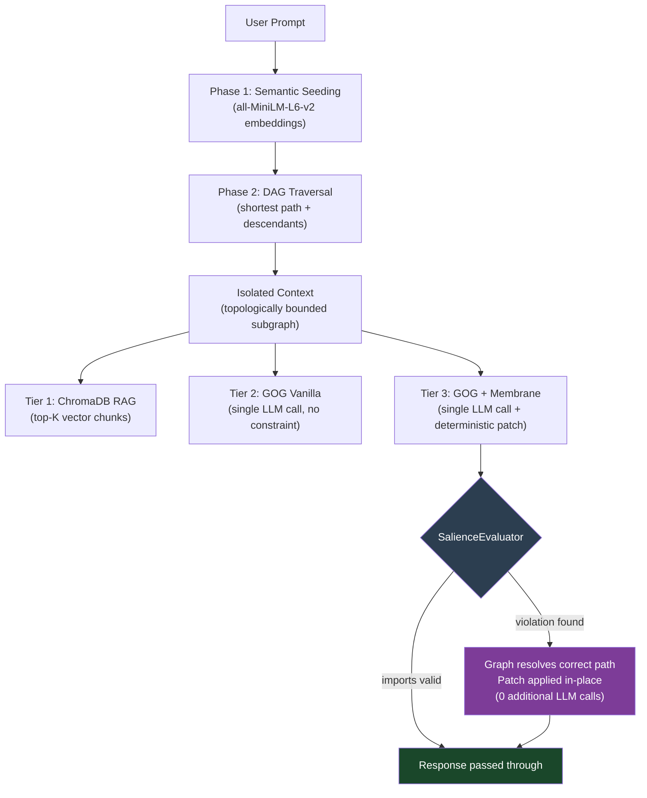

# Graph-Oriented Generation (GOG) — Symbolic Reasoning Model (SRM)

> **Active research prototype.** The architecture is under active development; the benchmarks are reproducible and the results are real. Structural feedback and contributions are welcome via issues or pull requests.

This repository implements and benchmarks **Graph-Oriented Generation (GOG)**, a context-isolation strategy for LLM-assisted code tasks that replaces probabilistic vector retrieval with deterministic graph traversal over a project's actual dependency structure.

The accompanying white paper is available in [`Graph_Oriented_Generation__GOG_.pdf`](./Graph_Oriented_Generation__GOG_.pdf).

---

## Motivation

Standard Retrieval-Augmented Generation (RAG) retrieves context by computing cosine similarity between a prompt embedding and a vector index of document chunks. For open-domain question answering over unstructured text, this is a reasonable approach. For software codebases, it introduces a structural mismatch:

> A software repository is not a collection of semantically similar documents — it is a directed graph of hard import dependencies. Two files can be semantically distant in embedding space yet be the only files that directly depend on each other. A vector search has no way to represent this relationship.

GOG addresses this by building a `networkx` directed acyclic graph (DAG) from the actual `import` statements in a codebase, parsed by a `tree-sitter` AST. Context isolation becomes a graph traversal problem rather than a similarity search problem. This produces a smaller, structurally correct context payload — with measurable token reduction and no false positives introduced by semantic noise.

### Relation to Prior Work

Microsoft's [GraphRAG](https://arxiv.org/abs/2404.16130) (Edge et al., 2024) applies graph structures to knowledge graphs built over document corpora for summarisation tasks. GOG operates on a different graph type — the structural import DAG of a software project — and targets a different task: precise dependency isolation for code generation rather than community-aware document retrieval. The two approaches are complementary rather than competing.

---

## Architecture

### Phase 1 — Semantic Seeding

The prompt is embedded using `all-MiniLM-L6-v2` (sentence-transformers). Each node's filename is converted to a readable label (e.g. `authStore.ts` → `"auth Store"`) and similarly embedded. Nodes whose cosine similarity to the prompt exceeds a configurable threshold (`SEED_SIMILARITY_THRESHOLD = 0.25`) are selected as entry points. This replaces the brittle keyword-matching approach described in the original paper (§4.5) and allows prompts that lack explicit architectural vocabulary to correctly identify seed nodes.

### Phase 2 — Deterministic Traversal

Once seed nodes are established, all context isolation is performed via standard graph operations: shortest-path between seed pairs and transitive descendant expansion. No probabilistic inference occurs after the seeding step. The resulting subgraph contains only files that are reachable from the seeds via real import edges.

### Phase 3 — Neuro-Symbolic Membrane (Tier 3 only)

The `SalienceEvaluator` acts as a post-generation constraint layer. After the LLM generates a response, the Membrane:

1. Extracts all `import` statements from the generated code via `tree-sitter` AST (with regex fallback for edge cases).
2. Checks each local import against the set of files the DAG isolated (`allowed_nodes`).
3. If all imports are valid: passes the response through unchanged.
4. If violations are found: **deterministically patches** each illegal import by resolving the correct path from `allowed_nodes` using basename matching — no second LLM call, no extra tokens.

If a hallucinated file has no match anywhere in the allowed set (i.e., the file genuinely does not exist in the graph), the import is commented out with a `// [SRM PATCH: hallucinated import removed]` annotation, keeping the output syntactically valid.



---

## Benchmark Design

Both benchmark scripts run three pipelines on identical code-generation tasks against a procedurally generated 100+ file Vue/TypeScript repository containing deliberate red-herring components (files that share keyword overlap with target prompts but have no structural connection to the execution path).

| Tier | Pipeline | Context Source | Post-generation Constraint |
|------|----------|---------------|---------------------------|
| **1** | RAG Control | ChromaDB top-5 vector chunks | None |
| **2** | GOG Vanilla | DAG-isolated subgraph | None |
| **3** | GOG + Membrane | DAG-isolated subgraph | Deterministic import patching |

### Task Prompts

| Level | Task | Structural Complexity |
|-------|------|-----------------------|
| Easy | Add `lastLogin` timestamp to `authStore.ts` | Single-file mutation |
| Medium | Wire a Logout button in `HeaderWidget.vue` to `useAuthStore` | Two-file dependency bridge |
| Hard | Implement Delete Account across `api_client.ts`, `authStore.ts`, `UserSettings.vue` — without importing `api_client.ts` directly into the Vue component | Three-file topological constraint |

### Representative Results

Results from a single run (cloud CLI, opencode). Token counts use `tiktoken` `cl100k_base` encoding.

| Metric | Tier 1 · RAG | Tier 2 · GOG | Tier 3 · GOG + Membrane |
|--------|-------------|-------------|------------------------|
| **Easy — Tokens In** | 53,137 | 6,323 | 6,323 |
| **Easy — Token Reduction** | baseline | **88.1% ↓** | **88.1% ↓** |
| **Easy — Topological Patches** | — | — | 1 (api_client hallucination caught) |
| **Hard — Tokens In** | 61,744 | 6,249 | 6,249 |
| **Hard — Token Reduction** | baseline | **89.9% ↓** | **89.9% ↓** |
| **Hard — Total Execution Time** | 64.8s | 65.5s | **45.7s** |

On the Hard task, the GOG context consisted of a single file (`api_client.ts`). Despite this minimal context, the LLM correctly reconstructed the three-file implementation by drawing on its parametric knowledge of Vue/Pinia patterns — producing the same correct answer as RAG at 89.9% lower token cost.

---

## Known Limitations

**Semantic seeder false positives.** The Medium task isolated `mockLogoutHandler.ts` alongside the two genuinely relevant files, reducing token savings from ~88% to ~23.7%. This occurred because `mockLogoutHandler` shares the `logout` keyword with the prompt. Semantic similarity over filenames cannot distinguish between a structurally relevant file and a semantically similar but architecturally disconnected one. A reachability-weighted scoring pass between seed candidates is the planned mitigation.

**Lexical seeding degrades on indirect prompts.** Prompts that use natural language without architectural vocabulary (e.g. "clicks logout from the settings view" rather than "UserSettings logout action") may fail to seed the graph at all, causing a fallback to full-graph context (equivalent to a RAG full-context dump). This is surfaced explicitly in the code rather than silently degraded.

**Benchmark is self-contained.** The target repository is procedurally generated, which allows controlled evaluation of red-herring resistance but limits external validity. Evaluation against real-world repositories is planned for a follow-up.

**Token counts are estimates.** `tiktoken` `cl100k_base` is used as a cross-model proxy. Actual token consumption will vary by model and tokenizer.

---

## Getting Started

### Requirements

```bash
pip install -r requirements.txt
```

Key dependencies: `networkx`, `tree-sitter`, `tree-sitter-typescript`, `chromadb`, `sentence-transformers`, `tiktoken`, `rich`.

> **NumPy compatibility note:** `sentence-transformers` currently requires `numpy<2`. If your environment has NumPy 2.x installed, create a virtual environment first:
> ```bash
> python3 -m venv .venv && source .venv/bin/activate
> pip install "numpy<2" && pip install -r requirements.txt
> ```

### Cloud CLI benchmark (recommended for output quality)

```bash
npm install -g opencode          # install opencode CLI
python3 generate_dummy_repo.py   # generate the 100+ file target repository
python3 seed_RAG_and_GOG.py      # build ChromaDB index + serialize GOG graph
python3 benchmark_cloud_cli.py   # run the 3-tier gauntlet
```

### Local SLM benchmark (fully offline, no API costs)

```bash
curl -fsSL https://ollama.com/install.sh | sh
ollama pull qwen2.5:0.5b
python3 generate_dummy_repo.py
python3 seed_RAG_and_GOG.py
python3 benchmark_local_llm.py
```

Both scripts present an interactive difficulty selector (`Easy / Medium / Hard / All`).

> **Note:** The local benchmark sets `num_gpu: 0` by default to avoid VRAM allocation errors on machines with limited GPU memory. Remove this flag in `benchmark_local_llm.py` if you want GPU acceleration.

---

## Contributing

The `TypeScriptParser` interface (`extract_imports(file_path) -> List[str]`) is designed to be extended. Parsers for Python, Go, Rust, or other languages with resolvable import graphs would meaningfully expand the benchmark's applicability.

Other areas where contributions are welcome:

- Additional benchmark prompts, particularly those that stress-test the seeder with indirect natural language
- Alternative seeding strategies (e.g. hybrid lexical + semantic, or structure-aware reachability scoring)
- Evaluation against real-world open-source repositories

Please open an issue before submitting a large pull request so we can align on approach first.

---

## Citation

If you use this work, please cite the accompanying paper:

```
Chisholm, D. R. (2026). Graph-Oriented Generation (GOG): Offloading AI Reasoning
to Deterministic Symbolic Graphs. https://github.com/dchisholm125/graph-oriented-generation
```