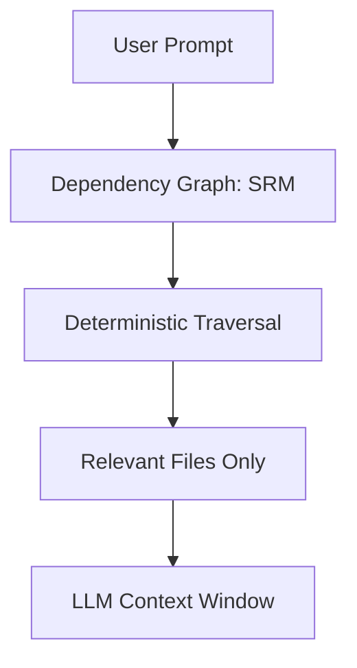

###### Note: This is my first time actively maintaining a public repo so bear with me if you are contributing! I am open to suggestions on structure, but do want to make sure chaos is managed well. Send me a DM if you have suggestions

## 🛑 Current Status

**Active Research Prototype — Contributions Welcome**

Thank you to everyone who checked out the project after the Hacker News and Reddit posts.  
The repository reached **24+ stars and 3 forks within the first day**, which is very encouraging for an early research prototype.

GOG is currently under active development as part of an ongoing research effort (Paper #2 in progress). My primary focus right now is continuing work on the **core mathematical engine**, particularly:

- deterministic dependency traversal
- $O(1)$ plasticity concepts

Because of that, development time is mostly concentrated on the core algorithm and benchmark framework.

However, the surrounding ecosystem is intentionally open for collaboration. If you're interested in helping expand the project — whether through additional language parsers, benchmarking, or tooling improvements — contributions are very welcome.

Open issues highlight areas where help would be especially valuable.

---

# GOG Benchmark (Graph-Oriented Generation) v 0.0.3

GOG explores whether **dependency graph traversal can replace vector retrieval**
for codebase reasoning in LLM workflows.

This repository evaluates the efficiency of **Symbolic Reasoning Model (SRM)** context isolation (GOG) compared to standard **Retrieval-Augmented Generation (RAG)** for large codebase understanding.

## Architecture

The benchmark consists of three core components:

*   **Python Engine:** Orchestrates the benchmark, parses the codebase, and interacts with the LLM API.
*   **SRM Engine:** Uses `networkx` to build a dependency graph of the codebase and isolate relevant files for a given prompt.
*   **Benchmark Harness:** A/B tests the context load and execution time between a full codebase dump (RAG) and isolated context (GOG).

## Architecture Overview



###### Note: I am currently seeking an arXiv endorser in the cs.IR and cs.AI category for the formal preprint of this paper. If you are eligible and find this work valuable, please reach out or endorse directly at https://urldefense.com/v3/__https://arxiv.org/auth/endorse?x=OVESPR__;!!DaRZpAeNFA!bDQ8GlkoWQn5HCz0RtmrPvpR_l4miMk56L2WuvsMq0eBQiWcGhq05BYb-bQV0b13Ewtg7RMYyl0fmLttsZM$!

## Setup

Setup takes ~2–3 minutes on a typical machine.

1.  **Install Dependencies:**
    ```bash
    pip install -r requirements.txt
    ```

2.  **Install OpenCode CLI:**
    The benchmarking suite uses the `opencode` CLI for all LLM interactions. Install it via NPM:
    ```bash
    npm install -g opencode
    ```

3.  **Generate the Maze:**
    Inflate the target repository with 50+ dummy files and a hidden "needle" component.
    ```bash
    python3 generate_dummy_repo.py
    ```

4.  **Seed RAG and GOG Environments:**
    Initialize the Vector DB and build the dependency graph. This step is required before running benchmarks.
    ```bash
    python3 seed_RAG_and_GOG.py
    ```

## Running the Benchmark

There are two primary ways to run the benchmark: via the Cloud-based OpenCode CLI or purely locally using an open-source Small Language Model (SLM) via Ollama.

### 1. Cloud Execution (OpenCode CLI)
Use this method to benchmark performance using state-of-the-art cloud models.

```bash
python3 benchmark_cloud_cli.py
```

### 2. Local SLM Execution (Ollama)
Use this method to prove that GOG is so efficient that it can run entirely on local resources using super-small models. This removes API latency and costs completely.

**Install Ollama & Prepare the Model:**
1. Download and install Ollama from [ollama.com](https://ollama.com) or run:
   ```bash
   curl -fsSL https://ollama.com/install.sh | sh
   ```
2. Pull the recommended lightweight model:
   ```bash
   ollama pull qwen2.5:0.5b
   ```
3. Run the local benchmark:
   ```bash
   python3 benchmark_local_llm.py
   ```

> [!TIP]
> The local benchmark is configured to force CPU execution by default (`num_gpu: 0`). This ensures stability on machines with low VRAM (e.g., < 4GB) and avoids "CUDA out of memory" or internal server errors during benchmarking.

## Expected Results

The SRM Engine should demonstrate a **70%+ reduction in token usage on average** by deterministically tracing the precise dependency paths, ignoring the dozens of noise components that plague typical Vector RAG setups. Furthermore, the Local Compute Time metric will highlight the fundamental difference in overhead between $O(n)$ vector scaling and $O(1)$ graph traversal.
